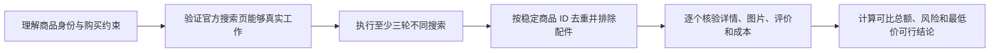

# 拼多多商品价格与风险研究

## 必须遵守的边界

只通过本目录的 Runner 执行完整任务

只读取拼多多官方公开页面，不使用搜索摘要代替页面证据

只执行搜索、读取、筛选、核验和分析

禁止执行下单 发起拼单 参团 加购 领券 关注 联系商家 评价或其他账户写入

登录、扫码、短信和验证码必须由用户亲自完成

遇到宿主策略阻止、验证码或限流后立即停止自动操作

只有 Runner 返回 `status=completed` 时才能给出最终结论

## 入口准备

读取 `schemas/input.schema.json`

把用户请求整理为商品、市场、地区、币种、成色、预算和详情数量

只保留国家或城市级地区

禁止保存姓名、电话、详细地址、账号、Cookie、验证码和订单信息

## 固定执行顺序



| 节点 | 任务 | 执行方式 |
|---|---|---|
| `plan-research` | 固化商品身份、查询词、地区、币种和采集上限 | reasoning |
| `preflight-access` | 在独立可视 Chrome 中完成一次真实搜索跳转 | mcp |
| `collect-search-rounds` | 串行执行三至五轮搜索并记录结果卡片 | mcp |
| `merge-and-shortlist` | 去重、过滤错误商品并选择详情候选 | script |
| `inspect-details` | 核验目标规格、价格条件、卖家、图片、评价和成本 | mcp |
| `rank-offers` | 计算可比总额、风险、资格和最终排名 | script |

## 浏览器怎样执行

先读取 [浏览器后端路由](references/backend-routing.md) 和 [多轮采集规则](references/multi-round-collection.md)

当前任务必须已经加载 `aialra-shopping-browser` MCP

使用它启动的独立持久 Chrome，不连接用户日常 Chrome

外部观察先通过插件通用观察 Schema，再映射为当前节点输出 Schema

第一次访问拼多多前选择后端，成功后整次运行保持不变

同一时间只使用一个页面

相邻自动动作至少间隔三秒

十五分钟内已经取得的页面观察优先复用

出现登录、短信、验证码、人机检查、限流或策略阻止后不自动重试

禁止读取 Cookie、本地存储、密码库、历史记录和设备指纹

禁止使用代理轮换、验证码破解、指纹伪装和隐身浏览器

## 多轮搜索怎样完成

至少准备三个不同查询词

查询词分别覆盖精确型号、常见别名、关键规格和容易混淆的配件

只有页面真实提供排序控件时才能记录价格排序或最新排序

每一轮记录查询词、排序、排名、商品 ID、商品链接和抓取时间

连续两轮新增商品数量不高于计划阈值后可以判定结果趋于饱和

达到上限前仍未饱和时必须报告覆盖缺口

## 详情与价格怎样核验

搜索结果卡片只用于发现候选，不能直接成为最终赢家

详情页必须确认完整商品、目标规格、在售状态和直接价格

单买价、拼单价、多人团价、新客价和账户优惠必须分别标注条件

优惠只有在页面已经明确展示并且当前用户满足条件时才能扣除

税费、运费或进口费用未知时必须保留 `unknown`

无法取得完整到手成本时只能报告最低已知金额

先读取 [风险与排序规则](references/risk-rules.md)

价格明显低于同类商品、卖家评价不足、退货未知、规格矛盾或评价集中出现质量问题时必须提高风险

高风险商品不能成为最低价可行赢家

## 外部结果怎样提交

把当前节点结果保存为节点要求的 JSON

```bash
python3 scripts/runner.py submit \
  --state-id "<state-id>" \
  --node-id "<node-id>" \
  --output "<output.json>"
```

缺失字段使用 Schema 允许的 `unknown`、空数组或省略值

无法得到合格结果时调用 `runner.py fail`

禁止猜测价格、库存、运费、税费、优惠、销量、评分和评价

## 最终结果必须包含

- 查询时间、市场、地区、币种、目标规格和购买假设
- 实际执行的搜索词、轮次、结果数量和饱和状态
- 经过详情核验的候选商品
- 商品价格、运费、税费、优惠条件和已知总额
- 卖家、图片、评价信号、风险理由和直达链接
- 最低价可行结论或没有可行商品的明确结论
- 登录墙、验证码、失败页面和其他覆盖缺口

每一项价格必须附带含时区的抓取时间

每一个推荐必须能够由最终 JSON 和 validator 复核

## 完成与学习

Runner 返回 `completed` 后再向用户报告

可复用经验只能写入脱敏学习事件

学习内容不得包含商品完整 URL、账号、详细地址、页面原文或个人信息

学习规则不能改变工作流、权限、确认要求、风险阈值和 validator
