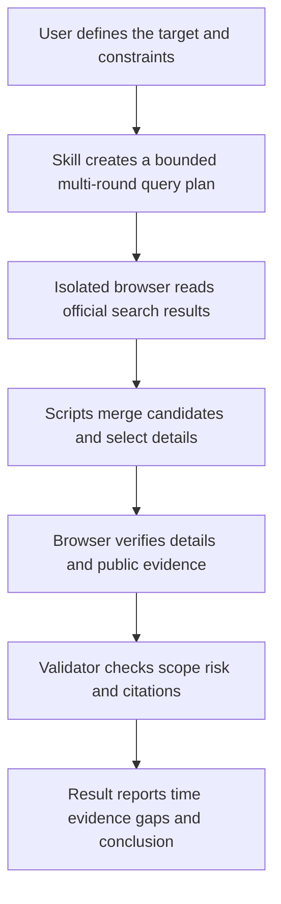

<div align="center">

<h1>Pinduoduo Price Research Skill</h1>

<p><strong>Verify current prices, details, images, sellers, reviews, and price conditions across multiple rounds before selecting the lowest feasible offer</strong></p>

<p>
  <a href="CHANGELOG.md"></a>
  <a href="#2-read-only-and-security-boundaries"></a>
  <a href="#3-how-it-works"></a>
  <a href="README.md"></a>
</p>

<p>
  <a href="#1-project-positioning">Positioning</a> ·
  <a href="#3-how-it-works">How it works</a> ·
  <a href="#5-installation">Installation</a> ·
  <a href="#6-validation">Validation</a> ·
  <a href="#7-start-a-live-task">Usage</a> ·
  <a href="SECURITY.md">Security</a>
</p>

<p><a href="README.md">简体中文</a> · <a href="README.en.md">English</a></p>

</div>

## 1 Project positioning

This repository contains the read-only `pinduoduo-price-research` Codex Skill

When a user asks for research on 拼多多, the Agent verifies current prices, detail pages, images, sellers, reviews, price conditions, and purchase risks and produces a traceable conclusion

<div align="center">

Table 1.1 Project scope

| Item | Current content |
|---|---|
| Primary deliverable | product price and purchase-risk research Skill |
| Current version | `0.2.1`, from the repository `VERSION` file |
| Evidence scope | current prices, detail pages, images, sellers, reviews, price conditions, and purchase risks |
| Operating mode | Read-only research with no platform writes |
| Documentation | Chinese primary README and English mirror |

</div>

## 2 Read-only and security boundaries

- The Skill does not place orders, add items to a cart, claim coupons, subscribe, contact merchants, or publish reviews
- The Skill does not export cookies, accounts, passwords, verification codes, or browser storage
- The Skill does not bypass CAPTCHAs or spoof browser fingerprints
- The Skill does not treat search snippets, reposts, or model memory as current direct evidence
- The repository does not store login data, exact addresses, orders, complete tool output, or unredacted run artifacts

When the live site requires a login, text message, QR scan, or verification challenge, the Agent pauses for the user to act directly

## 3 How it works

The platform Skill plans queries, defines evidence, merges multiple rounds, and calculates risk or synthesizes conclusions

The installed `AIALRA Shopping Browser` plugin launches an isolated visible Chrome browser and reads official pages

Login data remains in the browser's local profile and never enters this Git repository

<div align="center">



Figure 3.1 Read-only evidence flow for Pinduoduo Price Research Skill

</div>

## 4 Repository structure

<div align="center">

Table 4.1 Main directories and files

| Location | Purpose |
|---|---|
| `.agents/skills/pinduoduo-price-research/SKILL.md` | Defines triggers and mandatory Agent behavior |
| `.agents/skills/pinduoduo-price-research/workflow.yaml` | Fixes node order, executors, permissions, failure paths, and stop conditions |
| `.agents/skills/pinduoduo-price-research/schemas/` | Defines the structures accepted and returned by every node |
| `.agents/skills/pinduoduo-price-research/scripts/` | Runs the workflow, deduplicates, ranks, or validates results |
| `.agents/skills/pinduoduo-price-research/references/` | Documents browser use, multi-round collection, risk, and acceptance rules |
| `tests/` | Verifies successful and security-failure paths |
| `learning/` | Stores only redacted lessons and proposals awaiting review |
| `SECURITY.md` | Defines credential, personal-data, and external-write boundaries |

</div>

## 5 Installation

Run the following command from the repository root:

```bash
python3 scripts/install_local.py # Link this Skill into the personal Codex Skill directory
```

The installer does not copy cookies, browser profiles, or run records

The Skill becomes available in new Codex tasks after installation

## 6 Validation

Run these commands from the repository root:

```bash
python3 scripts/validate.py # Validate repository structure, workflow, and domain rules
python3 -m unittest discover -s tests -v # Run success-path and security-failure tests
python3 scripts/check_secrets.py . # Scan the repository for suspected sensitive data
```

Repository structure, workflow, domain rules, tests, and secret scanning are considered valid only after every command succeeds

## 7 Start a live task

Create a new Codex task and enter:

```text
# Copy the next line into a new Codex task
Use $pinduoduo-price-research to search Pinduoduo in multiple rounds and verify the current lowest feasible offer
```

The Agent reports query time, current coverage, key evidence, unknown conditions, and the reason for stopping

## 8 Project status

The following status comes from the repository `VERSION`, `SECURITY.md`, workflow, and root-file inspection

<div align="center">

Table 8.1 Public delivery boundaries

| Object | Current status | Adoption boundary |
|---|---|---|
| Skill version | `0.2.1` | Review `CHANGELOG.md` before use |
| Platform actions | Read-only | Orders, interactions, and external writes remain out of scope |
| Login data | Stored outside the repository | Cookies, passwords, verification codes, and browser profiles must not be committed |
| Evidence freshness | Collected during each run | Search snippets and model memory cannot replace current official pages |
| Repository license | Not provided | Public visibility does not grant rights to copy, modify, redistribute, or use commercially |

</div>

## 9 Security response

Do not commit cookies, accounts, passwords, verification codes, exact addresses, orders, or page-storage files to Git

If sensitive information is found, stop the commit, remove the material, and rerun the secret scan

See [SECURITY.md](SECURITY.md) for the complete policy
