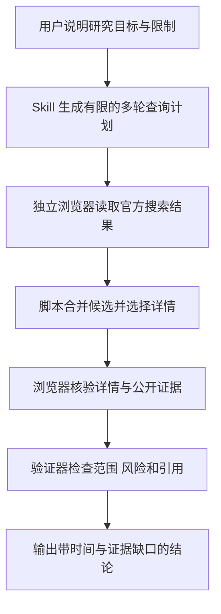

<div align="center">

<h1>拼多多价格研究 Skill</h1>

<p><strong>多轮核验当前商品价格、详情、图片、卖家、评价和价格条件，再给出最低价可行结论</strong></p>

<p>
  <a href="CHANGELOG.md"></a>
  <a href="#access-boundary"></a>
  <a href="#evidence-workflow"></a>
  <a href="README.en.md"></a>
</p>

<p>
  <a href="#project-positioning">项目定位</a> ·
  <a href="#evidence-workflow">工作方式</a> ·
  <a href="#installation">安装</a> ·
  <a href="#validation">验证</a> ·
  <a href="#live-task">使用示例</a> ·
  <a href="SECURITY.md">安全规则</a>
</p>

<p><a href="README.md">简体中文</a> · <a href="README.en.md">English</a></p>

</div>

<a id="project-positioning"></a>

## 1 项目定位

这个仓库保存一个只读的 `pinduoduo-price-research` Codex Skill

用户要求研究 拼多多 时，Agent 会核验当前商品价格、详情页、图片、卖家、评价、价格条件和购买风险，然后输出可追溯结论

<div align="center">

表 1.1 项目范围

| 项目 | 当前内容 |
|---|---|
| 主要交付物 | 商品价格与购买风险研究 Skill |
| 当前版本 | `0.2.1`，来源为仓库 `VERSION` 文件 |
| 证据范围 | 当前商品价格、详情页、图片、卖家、评价、价格条件和购买风险 |
| 执行模式 | 只读研究，不产生平台写入 |
| 文档语言 | 简体中文主文档和英文镜像 |

</div>

<a id="access-boundary"></a>

## 2 研究权限边界

- Skill 不会执行下单、加购、领券、订阅、联系商家或发布评价
- Skill 不会导出 Cookie、账号、密码、验证码和浏览器存储
- Skill 不会破解验证码或伪装浏览器指纹
- Skill 不会把搜索摘要、转载或模型记忆当作当前直接证据
- 仓库不会保存登录资料、详细地址、订单、完整工具输出或未脱敏运行产物

真实网站要求登录、短信、扫码或验证码时，Agent 会暂停并等待用户亲自操作

<a id="evidence-workflow"></a>

## 3 工作方式

平台 Skill 负责规划查询、定义证据、合并多轮结果并计算风险或综合结论

已经安装的 `AIALRA Shopping Browser` 插件负责启动独立可视 Chrome 浏览器并读取官方页面

登录资料保存在浏览器自己的本地目录，不进入这个 Git 仓库

<div align="center">



图 3.1 拼多多价格研究 Skill 的只读证据流程

</div>

## 4 仓库结构

<div align="center">

表 4.1 主要目录与文件

| 位置 | 用途 |
|---|---|
| `.agents/skills/pinduoduo-price-research/SKILL.md` | 定义触发条件和 Agent 必须遵守的运行规则 |
| `.agents/skills/pinduoduo-price-research/workflow.yaml` | 固定节点顺序、执行器、权限、失败路径和停止条件 |
| `.agents/skills/pinduoduo-price-research/schemas/` | 定义每个节点允许接收和返回的数据结构 |
| `.agents/skills/pinduoduo-price-research/scripts/` | 运行工作流、去重、排名或验证结果 |
| `.agents/skills/pinduoduo-price-research/references/` | 保存浏览器、多轮采集、风险和验收说明 |
| `tests/` | 验证成功路径和安全失败路径 |
| `learning/` | 只保存脱敏经验和待审计提案 |
| `SECURITY.md` | 说明凭据、个人数据和外部写入边界 |

</div>

<a id="installation"></a>

## 5 安装

在仓库根目录运行以下命令：

```bash
python3 scripts/install_local.py # 把当前 Skill 连接到 Codex 的个人 Skill 目录
```

安装程序不会复制 Cookie、浏览器配置或运行记录

安装完成后，Skill 会在 Codex 的新任务中可用

<a id="validation"></a>

## 6 验证

在仓库根目录依次运行以下命令：

```bash
python3 scripts/validate.py # 检查仓库结构、工作流和领域规则
python3 -m unittest discover -s tests -v # 运行成功路径和安全失败路径测试
python3 scripts/check_secrets.py . # 扫描仓库中的疑似敏感信息
```

全部命令成功后，仓库结构、工作流、领域规则、测试和敏感信息扫描才算通过

<a id="live-task"></a>

## 7 开始真实任务

新建 Codex 任务并输入：

```text
# 将下一行作为新的 Codex 任务
使用 $pinduoduo-price-research 多轮搜索并核验拼多多当前最低价可行商品
```

Agent 会在结果中说明查询时间、当前覆盖、关键证据、未知条件和停止原因

## 8 项目状态

以下状态来自仓库 `VERSION`、`SECURITY.md`、工作流和根目录文件检查

<div align="center">

表 8.1 公开交付边界

| 对象 | 当前状态 | 采用边界 |
|---|---|---|
| Skill 版本 | `0.2.1` | 使用前可以通过 `CHANGELOG.md` 核对变化 |
| 平台操作 | 只读 | 任何下单、互动或外部写入都不在当前范围内 |
| 登录数据 | 仓库外保存 | Cookie、密码、验证码和浏览器资料禁止提交 |
| 证据时效 | 运行时取得 | 搜索摘要和模型记忆不能代替当前官方页面 |
| 仓库许可证 | 未提供 | 公开可见不自动授予复制、修改、再分发或商业使用权 |

</div>

## 9 安全响应

不要把 Cookie、账号、密码、验证码、详细地址、订单和页面存储文件提交到 Git

发现敏感信息时立即停止提交，移除内容后重新运行敏感信息扫描

完整规则见 [SECURITY.md](SECURITY.md)
